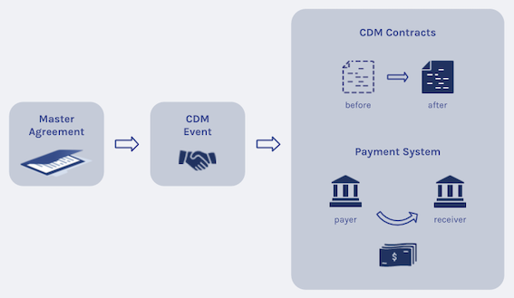

# The DAML model

## Overview

The following picture outlines a high level overview of the model:

The central starting point is a [master agreement](../daml/Main/MasterAgreement.daml#L15-L22) which essentially models a trade relationship between two parties. Once it is in place, it allows to create new events. It is important to note that all the parties involved to an event need to agree. Once they did, the event gets executed. The result of the execution is either the creation of new (CDM) contracts or the modification of existing (CDM) contracts (by archiving previous and creating new ones). In addition, it might move assets such as cash from the payer to the receiver.

## Architecture

A more detailed architecture is shown below:

**Insert picture (TBA)**

### Events
Starting from the [master agreement](../daml/Main/MasterAgreement.daml#L15-L22), new events like a [new trade](../daml/Main/MasterAgreement.daml#L24-L32) or [termination](daml/Main/MasterAgreement.daml#L34-L42) event can be proposed by any party.

This results in an [EventProposal](../daml/Main/Event/Proposal.daml#L8-L38) from one party to the other parties involved in the event. Once the event has been accepted by all parties, an `EventInstance` gets created.

From the [EventInstance](../daml/Main/Event/Instance.daml#L14-L23) the [lifecycling](../daml/Main/Event/Instance.daml#L35-L49) can be triggered by consuming a list of [ContractInstance](../daml/Main/Market/Contract.daml#L8-L20)s. The result of the choice is a list of new or modified `ContractInstance`s and an [EventNotification](../daml/Main/Event/Notification.daml#L7-L16).

It is worth noting that all event templates hold a single CDM event. Through CDM's primitive event concept the CDM event type is flexible enough to capture all kind of events.

Besides proposing negotiated events where all parties need to accept first, the master agreement also allows to [create derived events](../daml/Main/MasterAgreement.daml#L54-L62). Those events have been pre-agreed on when the parties entered the trade / CDM contract. Examples are reset events for a basis swaps, upfront fees for credit default swaps, or interest rate payments for interest rate swaps. The important fact here is that the parties involved do not have to agree on the event again. As a consequence, the execution of the `CreateDerivedEvent` choice directly results in an `EventInstance`.

### Cash

The DAML model also includes a simple [cash asset model](../daml/Main/Market/Cash.daml#L17-L57). If the event includes a cash transfer, cash is moved from the payer to the receiver by first [instructing](../daml/Main/Event/Instance.daml#L25-L33) the cash transfer. The payer can then allocate cash to the [CashTransferInstruction](../daml/Main/Market/Cash.daml#L96-L132). Once all cash transfer instruction are allocated, it is possible to lifecycle the event which also settles cash transfer next to moving contracts.

### Reference Data

Given that swaps depend on [reference data](../daml/Main/ReferenceData.daml) in general, they are modeled as well. An interest rate swap, e.g., requires holiday calendars to roll out schedules or might need interest rate fixings to determine a floating rate coupon.

### Workflows

Finally, some workflow templates are included in this DAML model:

* [DeriveEventsWorkflow](../daml/Main/Workflow/DeriveEvents.daml#L11-L37) allows to derive all (future) events for a contract that have not been processed so far. The result of the process is a list of [DerivedEvent](../daml/Main/Workflow/DeriveEvents.daml#L38-L68)(s). Note that the events mainly serve as information and is subject to changes if, e.g., an underlying holiday calendar changes.

* The [AllocateWorkflow](../daml/Main/Workflow/Allocate.daml#L7-L19) allows to allocate cash to a list of cash transfer instructions.
